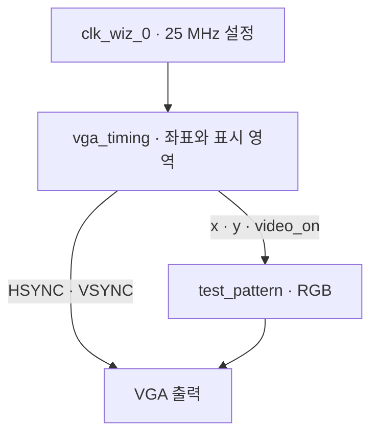

# FPGA TETRIS

### 작은 블록을 움직이는 게임, 클럭 단위로 설계하는 시스템

**SystemVerilog · ZedBoard · VGA**

Iowa State University · CPRE 487

[프로젝트 목표](#프로젝트-목표) · [현재 결과](#현재-결과) · [설계 구조](#설계-구조) · [다음 단계](#다음-단계)

---

> **현재 위치 — VGA 출력 기반 구현**  
> 합성과 Implementation을 완료하고 현재 지정된 타이밍 제약을 통과했습니다.  
> 실제 보드의 화면 출력과 테트리스 게임 동작은 후속 실험에서 검증할 예정입니다.

## 프로젝트 목표

저희 프로젝트의 목표는 **ZedBoard에서 동작하는 FPGA 테트리스**를 구현하는 것입니다. 화면 출력, 버튼 입력, 블록 이동과 충돌 판정, 줄 삭제를 하드웨어 모듈로 나누고 단계적으로 통합할 계획입니다.

첫 단계에서는 게임 화면을 표시할 기반을 마련하기 위해 VGA 타이밍과 RGB 테스트 패턴을 구성했습니다. 이후 입력 처리와 게임 로직을 연결하고, 시뮬레이션과 보드 관측을 통해 구현 결과를 확인할 예정입니다.

| 화면을 만든다 | 입력을 해석한다 | 게임 규칙을 구현한다 |
| :--- | :--- | :--- |
| 픽셀 좌표 · 동기 신호 · RGB 출력 | 동기화 · 디바운스 · 누름 이벤트 | 블록 이동 · 충돌 · 줄 삭제 · 점수 |
| **현재 개발 단계** | 다음 개발 단계 | 후속 통합 단계 |

## 현재 결과

**2026.10.05 · EXP 001 · 합성 및 Implementation 분석**

| Setup 여유 · WNS | Hold 여유 · WHS | Pulse Width 여유 · WPWS | 배선 실패 |
| :---: | :---: | :---: | :---: |
| **+36.521 ns** | **+0.131 ns** | **+3.000 ns** | **0건** |

VGA 타이밍 모듈의 누락된 로직을 보완한 뒤 합성을 다시 수행했습니다. 열린 합성 디자인에서 black box 조회 결과가 없음을 확인했고, 최종 배선 결과에서 사용자 지정 타이밍 제약을 통과했습니다.

| 확인 항목 | 현재 상태 |
| :--- | :--- |
| VGA 타이밍 · RGB 패턴 · 최상위 모듈 | 소스 구성 및 통합 합성 완료 |
| Clocking Wizard | 25 MHz 출력 설정, IP 생성 및 OOC 합성 완료 |
| Implementation | `route_design Complete` |
| Bitstream | 생성 실행, 완료 확인 대기 |
| ZedBoard · VGA 모니터 출력 | 연결 및 실측 확인 대기 |
| 버튼 입력 · 테트리스 게임 로직 | 미구현 |

> 타이밍 결과는 **현재 지정된 제약에 대한 정적 분석 결과**입니다. 표시 픽셀 수, 동기 신호 폭, 실제 화면 출력과 게임 동작은 아직 기능 검증 전입니다.

<strong>자원 및 실행 시간 보기</strong>

| 항목 | 관측값 |
| :--- | ---: |
| LUT | 30 |
| FF | 22 |
| BRAM / DSP | 0 / 0 |
| 합성 run 시간 | 59초 |
| Implementation run 시간 | 47초 |

자원 수치는 현재 VGA 기반 디자인의 결과입니다. 완성된 테트리스의 자원 사용량을 의미하지 않습니다. 시간은 해당 run에 표시된 값이며, IP 생성과 수정 시간은 포함하지 않습니다.

## 설계 구조

현재 구성은 픽셀 클럭을 기준으로 좌표와 동기 신호를 생성하고, 표시 영역의 좌표를 RGB 패턴으로 변환하는 방식입니다.

`top.sv`는 위 모듈을 연결하고 버튼과 클럭 잠금 상태를 기반으로 픽셀 도메인의 리셋을 구성합니다. VGA 출력은 아직 모니터에서 관측하지 않았습니다.

<strong>VGA 타이밍 설정 보기</strong>

| 구간 | 수평 · 픽셀 클럭 | 수직 · 라인 |
| :--- | ---: | ---: |
| Visible | 640 | 480 |
| Front porch | 16 | 10 |
| Sync pulse | 96 | 2 |
| Back porch | 48 | 33 |
| Total | **800** | **525** |

동기 신호는 active-low입니다. 코드 설정 기준으로 수평 동기는 `[656, 752)`, 수직 동기는 `[490, 492)` 구간입니다.

25 MHz와 800 × 525 설정의 계산상 프레임 주파수는 **약 59.524 Hz**이며, 실제 출력 주파수 측정값은 아닙니다.

## 다음 단계

| 단계 | 완료 기준 | 상태 |
| :--- | :--- | :--- |
| **01 · VGA 기반 구현** | 합성 · 배선 · 지정 타이밍 제약 통과 | 완료 |
| **02 · 화면 검증** | Bitstream 확인 · 보드 RGB 패턴 · 리셋 관측 · 파형 검사 | 다음 작업 |
| **03 · 입력과 화면 구성** | 버튼 동기화 · 디바운스 · 1회 누름 이벤트 · 게임 영역 | 예정 |
| **04 · 게임 로직** | 블록 생성 · 이동 · 회전 · 충돌 · 줄 삭제 · 점수 | 예정 |
| **05 · 통합 검증** | 기준 모델 비교 · 장시간 테스트 · 보드 시연 | 예정 |

## 개발 환경

| 항목 | 설정 |
| :--- | :--- |
| Board | ZedBoard |
| FPGA part | `xc7z020clg484-1` |
| Tool | Vivado 2020.1 |
| HDL | SystemVerilog |
| Input clock | 100 MHz |
| Pixel clock | 25 MHz 설정 |
| Visible resolution | 640 × 480 |

## 코드와 실험 기록

| 경로 | 관리할 내용 |
| :--- | :--- |
| `rtl/` | SystemVerilog 소스 |
| `constraints/` | 핀 및 클럭 제약 |
| `ip/` | Clocking Wizard `.xci` 설정 |
| `scripts/` | 프로젝트 및 IP 재생성 Tcl |
| `docs/reports/` | 계속 업데이트하는 메인 진행 리포트 |
| `docs/evidence/` | 타이밍 캡처 · 파형 · 보드 사진 |
| `reports/` | Vivado 분석 결과 |

파일 구조는 관리 기준입니다. IP 복사, 문서 배치, 원격 저장과 새 경로에서의 재생성 검증은 확인 대기입니다.

실험 기록에는 **코드 버전 → 실행 조건 → 관측값 → 해석 → 다음 조치**를 함께 남깁니다. 메인 진행 리포트에 날짜별 기록을 누적하고, 결과를 확인한 시점에 README의 상태도 갱신합니다.

### 실행 및 재현

현재는 Vivado 프로젝트에서 `top.sv`를 최상위 모듈로 사용하며, `clk_wiz_0`와 ZedBoard 제약 파일을 함께 구성합니다. 저장소의 재생성 Tcl과 IP 경로는 별도 검증이 필요합니다. 새 clone만으로 프로젝트가 재현되는지는 아직 확인하지 않았습니다.

---

**구현한 기능은 코드로, 확인한 결과는 증거로 기록합니다.**

FPGA Tetris · CPRE 487

