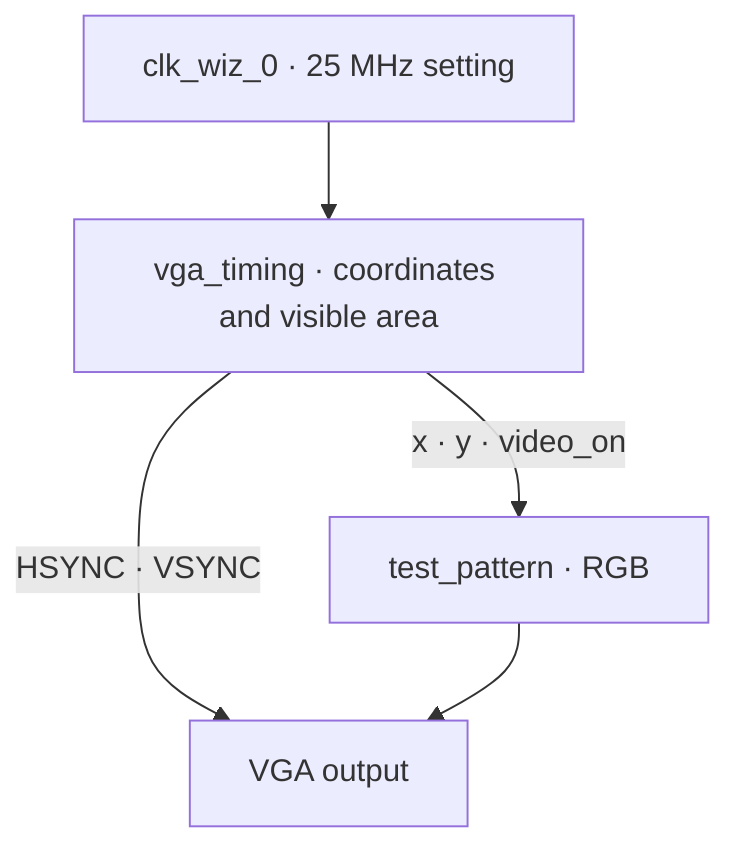

# FPGA TETRIS

### A game about moving small blocks, designed one clock cycle at a time

**SystemVerilog · ZedBoard · VGA**

Iowa State University · CPRE 487

[Project goal](#project-goal) · [Current results](#current-results) · [Design](#design) · [Next steps](#next-steps) · [My role](#my-role)

---

> **Where it stands — VGA output foundation**  
> Synthesis and implementation are complete and the design meets the timing constraints currently specified.  
> Output on a real monitor and the Tetris game logic will be verified in later experiments.

## Project goal

The goal is **Tetris running on a ZedBoard FPGA**, with no processor. Screen output, button input, block movement, collision detection and line clearing are split into hardware modules and integrated step by step.

The first step builds the foundation for drawing the game: VGA timing and an RGB test pattern. Input handling and game logic come next, each checked in simulation and on the board.

| Draw the screen | Read the input | Implement the rules |
| :--- | :--- | :--- |
| Pixel coordinates · sync signals · RGB output | Synchronize · debounce · press events | Move blocks · collide · clear lines · score |
| **Current stage** | Next stage | Later integration |

## Current results

**2026-10-05 · EXP 001 · Synthesis and implementation analysis**

| Setup slack · WNS | Hold slack · WHS | Pulse width slack · WPWS | Routing failures |
| :---: | :---: | :---: | :---: |
| **+36.521 ns** | **+0.131 ns** | **+3.000 ns** | **0** |

After filling in missing logic in the VGA timing module, synthesis was run again. The opened synthesized design reports no black boxes, and the final routed design meets the user-specified timing constraints.

| Item | Status |
| :--- | :--- |
| VGA timing · RGB pattern · top module | Sources written and synthesized together |
| Clocking Wizard | Configured for 25 MHz, IP generated, out-of-context synthesis complete |
| Implementation | `route_design Complete` |
| Bitstream | Generation started, completion not yet confirmed |
| ZedBoard · VGA monitor output | Not yet connected or measured |
| Button input · Tetris game logic | Not implemented |

> The timing numbers are **static analysis results against the current constraints**. Visible pixel count, sync pulse widths, actual screen output and game behavior have not been functionally verified yet.

<strong>Resources and run time</strong>

| Item | Observed |
| :--- | ---: |
| LUT | 30 |
| FF | 22 |
| BRAM / DSP | 0 / 0 |
| Synthesis run time | 59 s |
| Implementation run time | 47 s |

These resource numbers describe the current VGA foundation only, not a finished Tetris. Run times are the values shown for those runs and exclude IP generation and editing time.

## Design

The pixel clock drives coordinate and sync generation, and the coordinates inside the visible area are turned into an RGB pattern.

`top.sv` connects these modules and builds the pixel-domain reset from the button and the clock-locked signal. VGA output has not been observed on a monitor yet.

<strong>VGA timing settings</strong>

| Region | Horizontal · pixel clocks | Vertical · lines |
| :--- | ---: | ---: |
| Visible | 640 | 480 |
| Front porch | 16 | 10 |
| Sync pulse | 96 | 2 |
| Back porch | 48 | 33 |
| Total | **800** | **525** |

Sync signals are active-low. As coded, horizontal sync covers `[656, 752)` and vertical sync covers `[490, 492)`.

With 25 MHz and 800 × 525, the calculated frame rate is **about 59.524 Hz**. This is not a measured output frequency.

## Next steps

| Step | Done when | Status |
| :--- | :--- | :--- |
| **01 · VGA foundation** | Synthesis, routing, and specified timing constraints pass | Done |
| **02 · Screen verification** | Bitstream confirmed · RGB pattern on the board · reset observed · waveform checked | Next |
| **03 · Input and screen layout** | Button synchronization · debounce · single press events · game area | Planned |
| **04 · Game logic** | Block spawn · move · rotate · collision · line clear · score | Planned |
| **05 · Integrated verification** | Comparison with a reference model · long-run test · board demo | Planned |

## My role

- Wrote the VGA timing module (`vga_timing.sv`), the test pattern (`test_pattern.sv`) and the top module (`top.sv`).
- Configured the 25 MHz pixel clock with the Clocking Wizard and wrote the ZedBoard pin constraints (`zedboard_vga.xdc`).
- Ran synthesis and implementation, and recorded timing, utilization and DRC reports by date.
- Wrote the project plan and this document.

## What I learned

- How VGA timing (horizontal and vertical sync, visible area) relates to the pixel clock.
- The Vivado flow: IP generation, synthesis, implementation, and reading a timing summary.
- Finding a black box in a synthesized design and filling in the logic that was missing.
- Numbering and dating every experiment, and separating what has been confirmed from what has not.

## Resources used

- ZedBoard Hardware User's Guide
- VGA 640×480 @ 60 Hz timing specification
- Xilinx Vivado 2020.1 and Clocking Wizard IP documentation

## Development environment

| Item | Setting |
| :--- | :--- |
| Board | ZedBoard |
| FPGA part | `xc7z020clg484-1` |
| Tool | Vivado 2020.1 |
| HDL | SystemVerilog |
| Input clock | 100 MHz |
| Pixel clock | 25 MHz setting |
| Visible resolution | 640 × 480 |

## Code and experiment records

| Path | What it holds |
| :--- | :--- |
| `rtl/` | SystemVerilog sources |
| `constraints/` | Pin and clock constraints |
| `ip/` | Clocking Wizard `.xci` configuration |
| `scripts/` | Tcl to regenerate the project and IP |
| `docs/reports/` | The main progress report, updated continuously |
| `docs/evidence/` | Timing captures · waveforms · board photos |
| `reports/` | Vivado analysis results |

This file structure is the intended layout. Copying the IP, placing the documents, and verifying regeneration from a fresh path are still pending.

Each experiment record keeps **code version → run conditions → observations → interpretation → next action** together. Records accumulate by date in the main progress report, and this README is updated when a result is confirmed.

### Running and reproducing

For now the Vivado project uses `top.sv` as the top module together with `clk_wiz_0` and the ZedBoard constraints file. The regeneration Tcl and IP paths in this repository still need separate verification; whether a fresh clone alone reproduces the project has not been checked.

---

**What is built is recorded as code. What is confirmed is recorded as evidence.**

FPGA Tetris · CPRE 487

